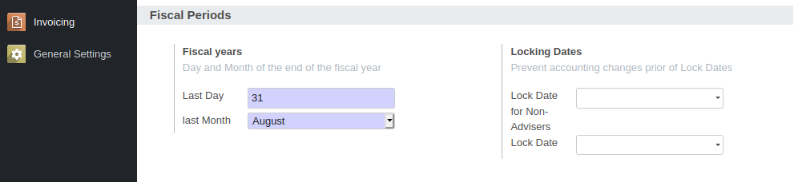

To configure this module, you need to:

* Add your users to the group 'Technical Settings / Show Full Accounting Features'

* Go to Invoicing > Configuration / Settings

* configure your accounting settings

