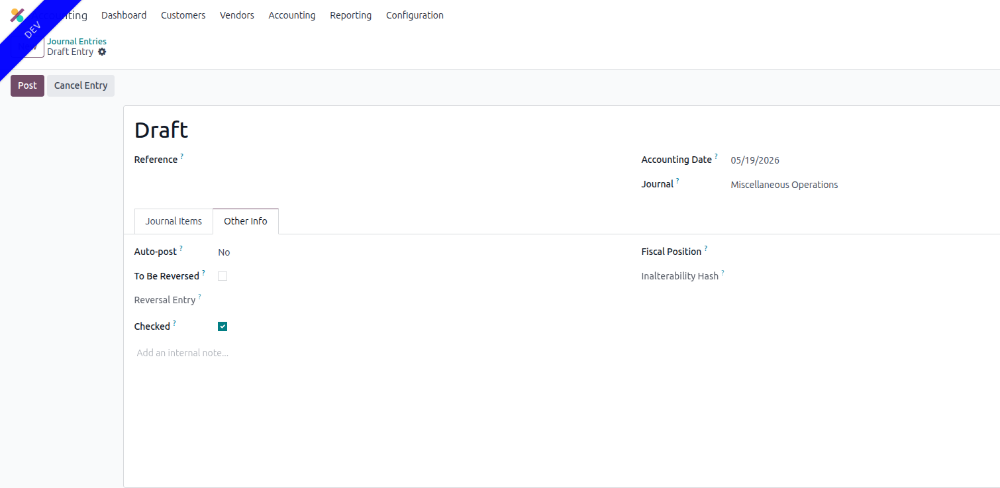
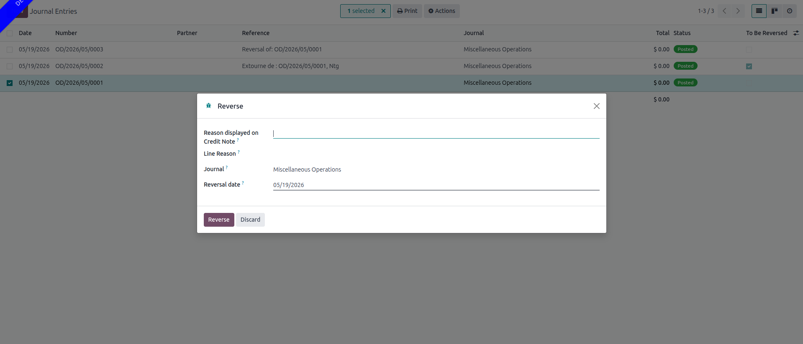

- To mark journal entries as 'To Be Reversed':

  > 1.  Go to Accounting \> Accounting \> Journals \> Journal Entries
  > 2.  In the journal entry, go to 'Other Info' tab and check the 'To
  >     Be Reversed' field.

- In order to allow tracking entries that must be reversed for any
  reason:

  > 1.  Go To Accounting \> Accounting \> Journals \> Journal Entries to
  >     be Reversed

- The Reverse wizard with both reasons looks like:

