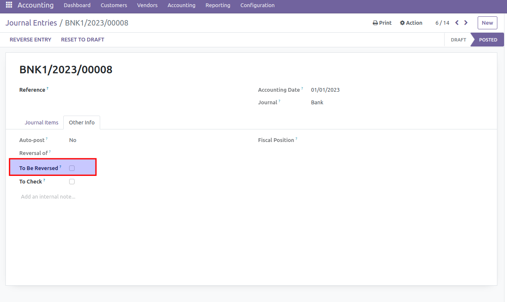
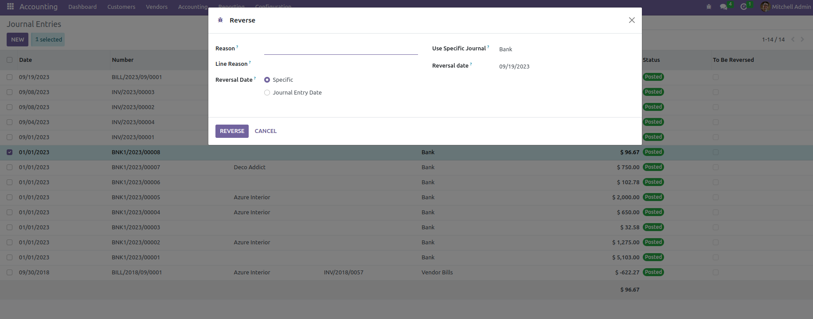

* To mark journal entries as 'To Be Reversed':

    #. Go to Accounting > Accounting > Journals > Journal Entries
    #. In the journal entry, go to 'Other Info' tab and check the 'To Be Reversed' field.

* In order to allow tracking entries that must be reversed for any reason:

    #. Go To Accounting > Accounting > Journals > Journal Entries to be Reversed

* The Reverse wizard with both reasons looks like:

