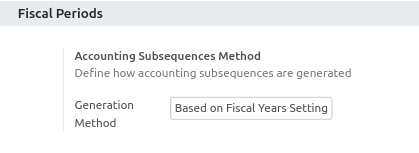

To configure this module, you need to:

* Add your users to the group 'Technical Settings / Show Full Accounting Features'

* Go to Invoicing > Configuration / Settings

* configure your accounting settings

Depending on what you want, 3 options are available.

Given the following example:

- an account move with a date set to 2030-06-01
- a company set with ``fiscalyear_last_day = 1`` and ``fiscalyear_last_month = 10``

* 'empty' (default value):
  the subsequence will be created "normaly", with ``date_from = 2030-01-01`` and ``date_to = 2030-12-31``

* 'Based on Company Settings':
  the subsequence will be created depending on the values of ``fiscalyear_last_day``
  and ``fiscalyear_last_month``, so ``date_from = 2029-10-01`` and ``date_to = 2030-09-30``

* 'Based on Fiscal Years Settings':
  the subsequence will be created with the values defined in the according fiscal year.
  Note that if no fiscal year is found, the generation will fail.
