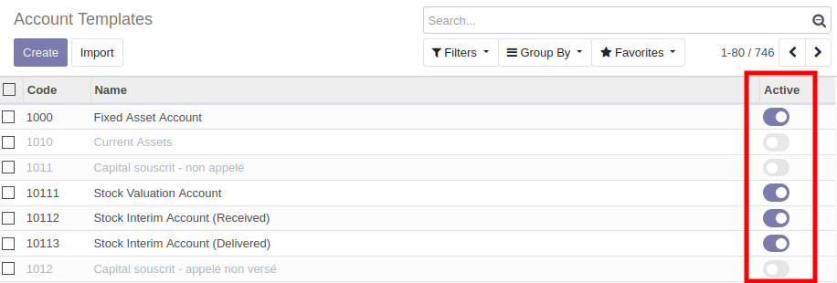
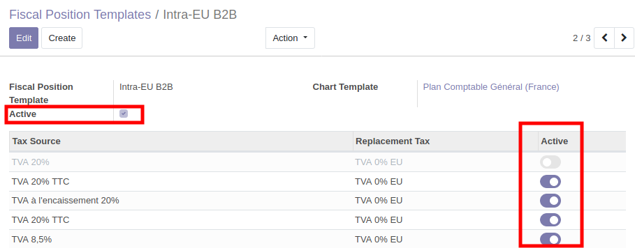
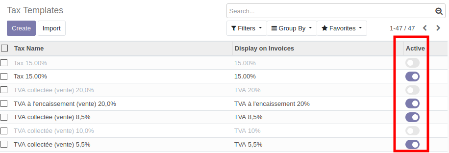

This module allows to disable account template items, adding
an ``active`` field on the following models:

* ``account.account.template``

* ``account.fiscal.position.template`` and it two related models
    * ``account.fiscal.position.account.template``
    * ``account.fiscal.position.tax.template``

This module can be interesting in a multi company context,
if you install a lot of accounting templates, with some changes.

It can also be interesting if you want to developp a custom localization
module based on the official one, but with some removed / added / altered items.

**Note:**

* The field ``active`` is present in the Odoo ``account`` module for the model
  ``account.tax.template``. for that field, this module only adds the ``active``
  field on the tree view.

For consistency reason,

* if user disables an ``account.account.template`` it will disable the related
  ``account.fiscal.position.account.template``

* if user disables an ``account.tax.template`` it will disable the related
  ``account.fiscal.position.tax.template``

* if user enables an ``account.fiscal.position.account.template`` it will enable the
  related ``account.account.template``

* if user enables an ``account.fiscal.position.tax.template`` it will enable the
  related ``account.tax.template``
