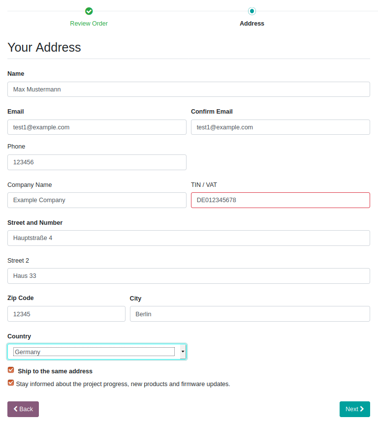

=====================
VAT online validation
=====================

.. !!!!!!!!!!!!!!!!!!!!!!!!!!!!!!!!!!!!!!!!!!!!!!!!!!!!
   !! This file is generated by oca-gen-addon-readme !!
   !! changes will be overwritten.                   !!
   !!!!!!!!!!!!!!!!!!!!!!!!!!!!!!!!!!!!!!!!!!!!!!!!!!!!

.. |badge1| image:: https://img.shields.io/badge/maturity-Beta-yellow.png
    :target: https://odoo-community.org/page/development-status
    :alt: Beta
.. |badge2| image:: https://img.shields.io/badge/licence-AGPL--3-blue.png
    :target: http://www.gnu.org/licenses/agpl-3.0-standalone.html
    :alt: License: AGPL-3
.. |badge3| image:: https://img.shields.io/badge/github-OCA%2Fodoo--modules-lightgray.png?logo=github
    :target: https://github.com/OCA/odoo-modules/tree/12.0/vat_online_validation
    :alt: OCA/odoo-modules
.. |badge4| image:: https://img.shields.io/badge/weblate-Translate%20me-F47D42.png
    :target: https://translation.odoo-community.org/projects/odoo-modules-12-0/odoo-modules-12-0-vat_online_validation
    :alt: Translate me on Weblate

|badge1| |badge2| |badge3| |badge4| 

This module makes online validation of VAT numbers with EU's VIES service mandatory. If during checkout, ecommerce customers enter a VAT number it is validated online. If validation fails Odoo shows an error message to the customer. Customers don't have to enter a VAT number but can leave the field empty.

**Table of contents**

.. contents::
   :local:

Bug Tracker
===========

Bugs are tracked on `GitHub Issues <https://github.com/OCA/odoo-modules/issues>`_.
In case of trouble, please check there if your issue has already been reported.
If you spotted it first, help us smashing it by providing a detailed and welcomed
`feedback <https://github.com/OCA/odoo-modules/issues/new?body=module:%20vat_online_validation%0Aversion:%2012.0%0A%0A**Steps%20to%20reproduce**%0A-%20...%0A%0A**Current%20behavior**%0A%0A**Expected%20behavior**>`_.

Do not contact contributors directly about support or help with technical issues.

Credits
=======

Authors
~~~~~~~

* Nitrokey GmbH

Maintainers
~~~~~~~~~~~

This module is maintained by the OCA.

.. image:: https://odoo-community.org/logo.png
   :alt: Odoo Community Association
   :target: https://odoo-community.org

OCA, or the Odoo Community Association, is a nonprofit organization whose
mission is to support the collaborative development of Odoo features and
promote its widespread use.

This module is part of the `OCA/odoo-modules <https://github.com/OCA/odoo-modules/tree/12.0/vat_online_validation>`_ project on GitHub.

You are welcome to contribute. To learn how please visit https://odoo-community.org/page/Contribute.
